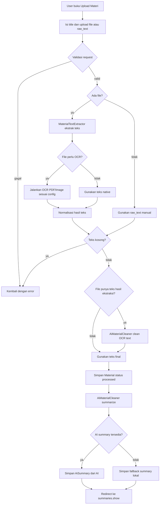
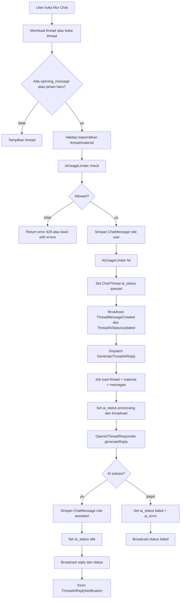
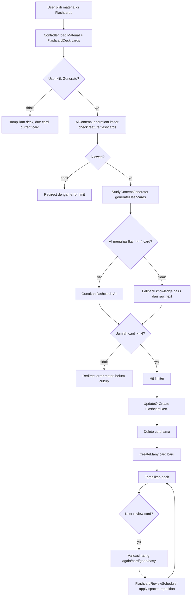
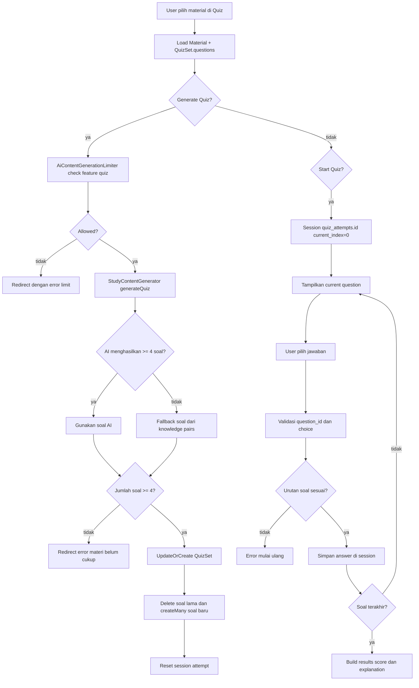
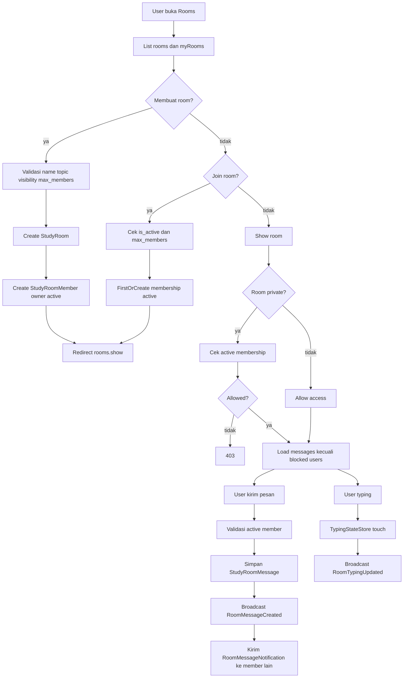
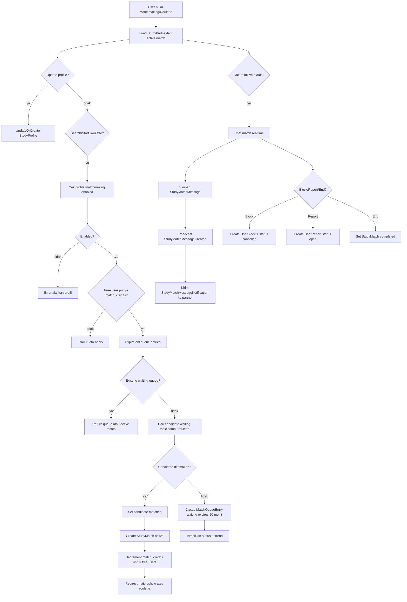
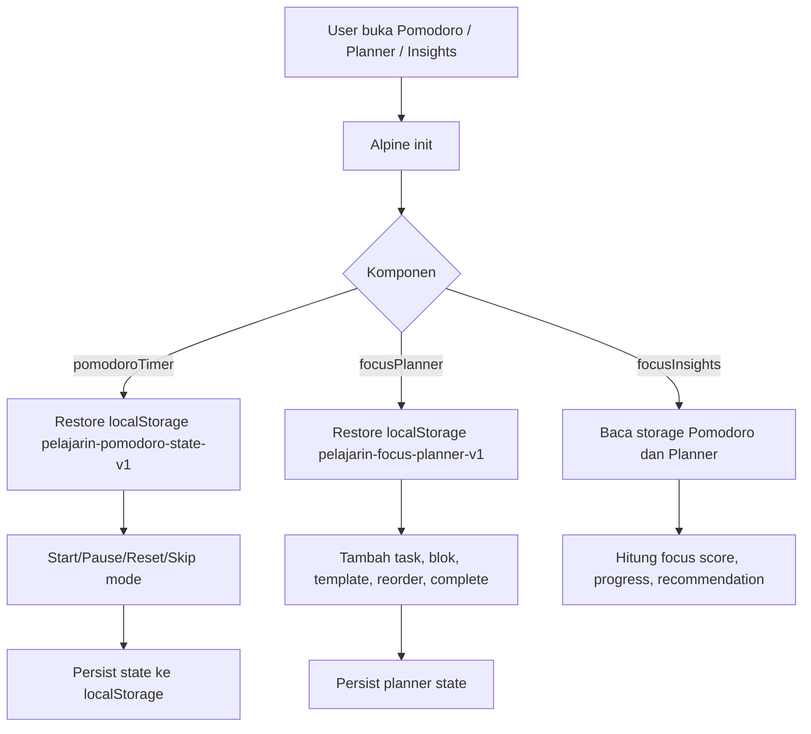
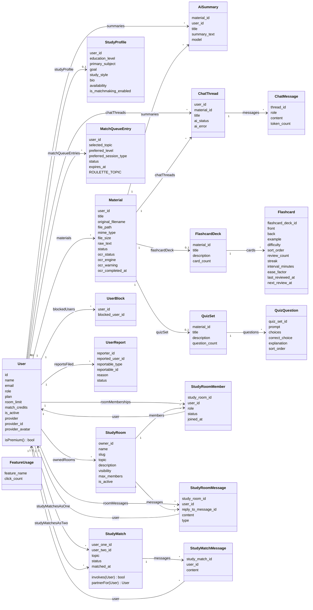

# Dokumentasi Use Case, Activity, dan Class Diagram Pelajarin.ai

Dokumen ini dibuat berdasarkan hasil scan struktur repository Laravel `Pelajarin.ai`, terutama dari direktori `routes`, `app`, `database`, `resources`, `config`, dan `tests`.

## 1. Ringkasan Repository

Pelajarin.ai adalah aplikasi pembelajaran berbasis Laravel 13 dengan Blade, Tailwind CSS, Vite, Alpine.js, Queue, dan Laravel Reverb. Sistem menyediakan upload materi belajar, ringkasan AI, tutor chat AI, flashcard, kuis, pomodoro/focus planner, study room realtime, study matching, notification center, social login, dan panel admin.

### Struktur Direktori Utama

```text
app/
  Contracts/              Kontrak service AI
  Data/                   DTO hasil AI
  Events/                 Event broadcast realtime
  Http/
    Controllers/          Controller publik, user, learning, auth, admin
    Middleware/           Middleware admin dan limit room
    Requests/             Form request profil dan auth
  Jobs/                   Job queue untuk balasan AI
  Models/                 Model Eloquent domain aplikasi
  Notifications/          Notifikasi database untuk chat/AI/room/match
  Providers/              Service provider aplikasi
  Services/
    Ai/                   Integrasi AI chat
    Learning/             Extractor materi, generator konten, matching, scheduler
  Support/                Helper limiter, payload realtime, typing state
bootstrap/                Bootstrap Laravel
config/                   Konfigurasi app, auth, broadcasting, queue, reverb, services
database/
  factories/              Factory testing
  migrations/             Skema tabel domain
  seeders/                Seeder demo/tester
public/                   Entry public, image logo, build Vite
resources/
  css/                    Tailwind/app CSS
  js/                     Alpine, realtime chat, pomodoro, planner
  views/                  Blade pages, layouts, components, auth, error
routes/                   Route web, auth, broadcast channel, console
tests/                    Feature dan unit tests
```

## 2. Modul dan File Penting

| Modul | File Utama | Tanggung Jawab |
| --- | --- | --- |
| Public | `routes/web.php`, `PricingController`, `pages/public/*` | Landing page, pricing, tracking klik fitur |
| Auth | `routes/auth.php`, `Http/Controllers/Auth/*`, `LoginRequest` | Register, login, logout, reset password, verification, social login Google/Discord |
| Dashboard | `routes/web.php`, `pages/user/dashboard.blade.php` | Ringkasan jumlah materi, summary, thread, room, match |
| Material | `MaterialController`, `MaterialTextExtractor`, `AiMaterialCleaner`, `Material` | Upload file/teks, ekstraksi teks, OCR, pembersihan AI, summary awal |
| Summary | `SummaryController`, `AiSummary` | Daftar dan detail ringkasan AI |
| AI Chat | `ChatThreadController`, `ChatMessageController`, `GenerateThreadAiReply`, `OpenAiThreadResponder` | Thread tutor AI, pesan, queue balasan, broadcast status |
| Flashcard | `FlashcardController`, `StudyContentGenerator`, `FlashcardReviewScheduler` | Generate deck/cards, spaced repetition review |
| Quiz | `QuizController`, `StudyContentGenerator`, `QuizSet`, `QuizQuestion` | Generate soal, sesi jawab via session, hasil kuis |
| Focus Tools | `resources/js/app.js`, `pomodoro.blade.php`, `focus/*` | Pomodoro, focus planner, focus insights berbasis localStorage |
| Study Room | `StudyRoomController`, `StudyRoomMessageController`, events room | Room publik/private, member, realtime chat, typing |
| Study Matching | `StudyMatchingController`, `StudyMatchingService`, matching models | Profil belajar, antrean, roulette, chat match, block/report |
| Notification | `NotificationController`, `Notifications/*` | Daftar notifikasi dan mark read |
| Admin | `AdminController`, `AdminUserController`, `AdminDocumentController` | Monitoring AI, statistik, user management, dokumen |
| Realtime | `routes/channels.php`, `Events/*`, `resources/js/realtime-chat.js` | Private channels `thread`, `room`, `match`, payload broadcast |

## 3. Use Case Diagram

### Aktor

| Aktor | Deskripsi |
| --- | --- |
| Guest | Pengunjung belum login. Bisa melihat landing/pricing, register, login, social login, reset password. |
| User | Pengguna login. Bisa memakai fitur belajar, social learning, focus tools, profil, dan notifikasi. |
| Premium User | User dengan `plan = premium`. Mendapat limit lebih besar untuk OCR, AI, room, dan matching. |
| Admin | User dengan role admin. Bisa mengelola user, dokumen, statistik, dan monitoring AI. |
| AI Provider | OpenAI/OpenRouter-compatible API untuk ringkasan, pembersihan materi, flashcard, kuis, chat tutor. |
| OCR Tools | Binary lokal seperti `pdftotext`, `pdftoppm`, dan `tesseract` untuk ekstraksi file. |
| Realtime System | Laravel Reverb/Echo untuk broadcast message, typing, dan status AI. |

```mermaid
flowchart LR
    Guest[Guest]
    User[User]
    PremiumUser[Premium User]
    Admin[Admin]
    AI[AI Provider]
    OCR[OCR Tools]
    RT[Realtime System]

    subgraph PublicUseCases[Public Use Cases]
        UC_Landing[Melihat Landing Page]
        UC_Pricing[Melihat Pricing]
        UC_Register[Register]
        UC_Login[Login]
        UC_SocialLogin[Login Google/Discord]
        UC_ResetPassword[Reset Password]
    end

    subgraph UserUseCases[User Use Cases]
        UC_Dashboard[Melihat Dashboard]
        UC_Upload[Upload Materi]
        UC_Material[Melihat Materi]
        UC_Summary[Melihat Ringkasan]
        UC_CreateThread[Membuat Chat Thread]
        UC_AiChat[Chat Tutor AI]
        UC_GenerateFlashcard[Generate Flashcard]
        UC_ReviewFlashcard[Review Flashcard]
        UC_GenerateQuiz[Generate Quiz]
        UC_DoQuiz[Mengerjakan Quiz]
        UC_Pomodoro[Menggunakan Pomodoro]
        UC_Planner[Mengelola Focus Planner]
        UC_Insights[Melihat Focus Insights]
        UC_CreateRoom[Membuat Study Room]
        UC_JoinRoom[Join/Leave Study Room]
        UC_RoomChat[Chat Room Realtime]
        UC_MatchProfile[Mengatur Profil Matching]
        UC_SearchMatch[Cari Partner Belajar]
        UC_Roulette[Study Roulette]
        UC_MatchChat[Chat Dengan Match]
        UC_BlockReport[Block/Report Partner]
        UC_Profile[Mengelola Profil]
        UC_Notification[Membaca Notifikasi]
    end

    subgraph PremiumUseCases[Premium Use Cases]
        UC_OcrLimit[OCR Lebih Banyak Halaman]
        UC_AiLimit[Limit AI Lebih Besar]
        UC_MatchNoCredit[Matching Tanpa Kredit Gratis]
    end

    subgraph AdminUseCases[Admin Use Cases]
        UC_AdminDashboard[Melihat Admin Dashboard]
        UC_MonitoringAi[Monitoring AI]
        UC_Stats[Statistik Pembelajaran]
        UC_UserStatus[Suspend/Aktivasi User]
        UC_Documents[Kelola Dokumen]
    end

    Guest --> UC_Landing
    Guest --> UC_Pricing
    Guest --> UC_Register
    Guest --> UC_Login
    Guest --> UC_SocialLogin
    Guest --> UC_ResetPassword

    User --> UC_Dashboard
    User --> UC_Upload
    User --> UC_Material
    User --> UC_Summary
    User --> UC_CreateThread
    User --> UC_AiChat
    User --> UC_GenerateFlashcard
    User --> UC_ReviewFlashcard
    User --> UC_GenerateQuiz
    User --> UC_DoQuiz
    User --> UC_Pomodoro
    User --> UC_Planner
    User --> UC_Insights
    User --> UC_CreateRoom
    User --> UC_JoinRoom
    User --> UC_RoomChat
    User --> UC_MatchProfile
    User --> UC_SearchMatch
    User --> UC_Roulette
    User --> UC_MatchChat
    User --> UC_BlockReport
    User --> UC_Profile
    User --> UC_Notification

    PremiumUser --> User
    PremiumUser --> UC_OcrLimit
    PremiumUser --> UC_AiLimit
    PremiumUser --> UC_MatchNoCredit

    Admin --> User
    Admin --> UC_AdminDashboard
    Admin --> UC_MonitoringAi
    Admin --> UC_Stats
    Admin --> UC_UserStatus
    Admin --> UC_Documents

    UC_Upload -. uses .-> OCR
    UC_Upload -. clean/summarize .-> AI
    UC_AiChat -. generate reply .-> AI
    UC_GenerateFlashcard -. optional generation .-> AI
    UC_GenerateQuiz -. optional generation .-> AI
    UC_AiChat -. broadcast status/message .-> RT
    UC_RoomChat -. broadcast message/typing .-> RT
    UC_MatchChat -. broadcast message/typing .-> RT
```



## 4. Activity Diagram

### 4.1 Upload Materi dan Generate Ringkasan

Berdasarkan `MaterialController::store`, `MaterialTextExtractor`, dan `AiMaterialCleaner`.



### 4.2 Chat Tutor AI

Berdasarkan `ChatThreadController`, `ChatMessageController`, `GenerateThreadAiReply`, dan `OpenAiThreadResponder`.



### 4.3 Generate dan Review Flashcard

Berdasarkan `FlashcardController`, `StudyContentGenerator`, dan `FlashcardReviewScheduler`.



### 4.4 Generate dan Mengerjakan Quiz

Berdasarkan `QuizController` dan `StudyContentGenerator`.



### 4.5 Study Room Realtime

Berdasarkan `StudyRoomController`, `StudyRoomMessageController`, events room, dan `routes/channels.php`.



### 4.6 Study Matching dan Roulette

Berdasarkan `StudyMatchingController` dan `StudyMatchingService`.



### 4.7 Focus Tools Frontend

Berdasarkan `resources/js/app.js`, `pomodoro.blade.php`, `focus/planner.blade.php`, dan `focus/insights.blade.php`.



## 5. Class Diagram Domain

Class diagram berikut fokus pada class Eloquent dan service utama yang ada di repository.



## 6. Class Diagram Service, Controller, Event, dan Job

```mermaid
classDiagram
direction TB

class MaterialController {
  index()
  create()
  store(Request, MaterialTextExtractor, AiMaterialCleaner)
  show(Material)
}

class SummaryController {
  index()
  show(AiSummary)
}

class ChatThreadController {
  index()
  store(Request)
  show(ChatThread)
}

class ChatMessageController {
  index(Request, ChatThread)
  store(Request, ChatThread, AiUsageLimiter)
}

class FlashcardController {
  index(Request)
  generate(Request, StudyContentGenerator, AiContentGenerationLimiter)
  review(Request, FlashcardDeck, FlashcardReviewScheduler)
}

class QuizController {
  index(Request)
  generate(Request, StudyContentGenerator, AiContentGenerationLimiter)
  start(QuizSet)
  answer(Request, QuizSet)
  reset(QuizSet)
}

class StudyRoomController {
  index(Request)
  store(Request)
  show(Request, StudyRoom)
  join(Request, StudyRoom)
  leave(Request, StudyRoom)
}

class StudyRoomMessageController {
  index(Request, StudyRoom, TypingStateStore)
  typing(Request, StudyRoom, TypingStateStore)
  store(Request, StudyRoom)
}

class StudyMatchingController {
  index(Request, StudyMatchingService)
  roulette(Request, StudyMatchingService)
  updateProfile(Request)
  search(Request, StudyMatchingService)
  cancel(Request, StudyMatchingService)
  rouletteStart(Request, StudyMatchingService)
  rouletteNext(Request, StudyMatchingService)
  rouletteStop(Request, StudyMatchingService)
  show(StudyMatch)
  messages(Request, StudyMatch, TypingStateStore)
  typing(Request, StudyMatch, TypingStateStore)
  sendMessage(Request, StudyMatch)
  end(StudyMatch)
  block(Request, StudyMatch)
  report(Request, StudyMatch)
}

class AdminController {
  index()
  monitoringAi()
  statistikPembelajaran()
}

class AdminUserController {
  index()
  suspend(User)
  activate(User)
}

class AdminDocumentController {
  index()
  destroy(Material)
}

class MaterialTextExtractor {
  extractFromUpload(UploadedFile, maxOcrPages)
}

class AiMaterialCleaner {
  clean(title, text)
  summarize(title, text)
}

class StudyContentGenerator {
  generateFlashcards(Material, limit, avoidFronts)
  generateQuiz(Material, limit, avoidPrompts)
}

class FlashcardReviewScheduler {
  apply(Flashcard, rating)
}

class StudyMatchingService {
  enqueue(User, payload)
  enqueueRoulette(User)
  cancel(User)
  cancelRoulette(User)
  findMatchFor(User)
  findRouletteMatchFor(User)
}

class AiThreadResponder {
  <<interface>>
  generateReply(ChatThread) AiReplyResult
}

class OpenAiThreadResponder {
  generateReply(ChatThread)
}

class GenerateThreadAiReply {
  threadId
  handle(AiThreadResponder)
}

class AiUsageLimiter {
  check(User)
  hit(User)
}

class AiContentGenerationLimiter {
  check(User, feature)
  hit(User, feature)
}

class RealtimePayloads {
  threadMessage(ChatMessage)
  roomMessage(StudyRoomMessage)
  matchMessage(StudyMatchMessage)
  threadStatus(ChatThread)
}

class TypingStateStore {
  touch(scope, channelId, userId, userName)
  active(scope, channelId, excludeUserId)
}

MaterialController --> MaterialTextExtractor
MaterialController --> AiMaterialCleaner
MaterialController --> Material
MaterialController --> AiSummary

ChatMessageController --> AiUsageLimiter
ChatMessageController --> GenerateThreadAiReply
GenerateThreadAiReply --> AiThreadResponder
OpenAiThreadResponder ..|> AiThreadResponder
GenerateThreadAiReply --> RealtimePayloads

FlashcardController --> StudyContentGenerator
FlashcardController --> AiContentGenerationLimiter
FlashcardController --> FlashcardReviewScheduler
QuizController --> StudyContentGenerator
QuizController --> AiContentGenerationLimiter

StudyMatchingController --> StudyMatchingService
StudyMatchingController --> TypingStateStore
StudyRoomMessageController --> TypingStateStore
StudyRoomMessageController --> RealtimePayloads
StudyMatchingController --> RealtimePayloads
```



## 7. Realtime dan Broadcast Channel

Private channel didefinisikan di `routes/channels.php`.

| Channel | Akses | Dipakai Untuk |
| --- | --- | --- |
| `App.Models.User.{id}` | User hanya bisa akses channel miliknya | Notifikasi private user |
| `thread.{threadId}` | Owner `ChatThread` | Status AI dan pesan tutor AI |
| `room.{roomId}` | Public room boleh dibaca; private harus active member | Chat room dan typing room |
| `match.{matchId}` | User harus user_one/user_two pada `StudyMatch` | Chat match dan typing match |

Event broadcast:

| Event | Channel | Payload |
| --- | --- | --- |
| `ThreadMessageCreated` | `thread.{threadId}` | Message tutor/user dari `RealtimePayloads::threadMessage` |
| `ThreadAiStatusUpdated` | `thread.{threadId}` | Status `queued`, `processing`, `idle`, `failed` |
| `RoomMessageCreated` | `room.{roomId}` | Pesan room |
| `RoomTypingUpdated` | `room.{roomId}` | User typing di room |
| `StudyMatchMessageCreated` | `match.{matchId}` | Pesan antar partner |
| `StudyMatchTypingUpdated` | `match.{matchId}` | User typing di match |

## 8. Database dan Relasi Tabel

Skema berasal dari `database/migrations`.

| Tabel | Sumber Migration | Isi Utama |
| --- | --- | --- |
| `users` | `0001_01_01_000000_create_users_table.php`, add role/product/social fields | Akun, role, plan, limit, social provider |
| `materials` | `2026_04_17_000001_create_materials_table.php`, OCR fields | Materi upload, file metadata, raw text, OCR status |
| `ai_summaries` | `2026_04_17_000002_create_ai_summaries_table.php` | Ringkasan AI per material/user |
| `chat_threads` | `2026_04_17_000003_create_chat_threads_table.php`, AI status fields | Thread tutor AI |
| `chat_messages` | `2026_04_17_000004_create_chat_messages_table.php` | Pesan user/assistant pada thread |
| `feature_usages` | `2026_04_17_064708_create_feature_usages_table.php` | Counter klik fitur publik |
| `study_profiles` | `2026_04_20_090100_create_study_profiles_table.php` | Profil matching user |
| `study_rooms` | `2026_04_20_090200_create_study_rooms_tables.php` | Room belajar |
| `study_room_members` | `2026_04_20_090200_create_study_rooms_tables.php` | Keanggotaan room |
| `study_room_messages` | `2026_04_20_090200_create_study_rooms_tables.php` | Chat room |
| `match_queue_entries` | `2026_04_20_090300_create_study_matching_tables.php` | Antrean partner belajar |
| `study_matches` | `2026_04_20_090300_create_study_matching_tables.php` | Pasangan belajar aktif/selesai |
| `study_match_messages` | `2026_04_20_090300_create_study_matching_tables.php` | Chat partner belajar |
| `user_blocks` | `2026_04_20_090300_create_study_matching_tables.php` | User yang diblokir |
| `user_reports` | `2026_04_20_090300_create_study_matching_tables.php` | Laporan user/match |
| `flashcard_decks` | `2026_04_20_091000_create_flashcard_decks_table.php` | Deck flashcard per material |
| `flashcards` | `2026_04_20_091001_create_flashcards_table.php` | Card dan metadata review |
| `quiz_sets` | `2026_04_20_091002_create_quiz_sets_table.php` | Set kuis per material |
| `quiz_questions` | `2026_04_20_091003_create_quiz_questions_table.php` | Soal pilihan ganda |
| `notifications` | `2026_04_21_160000_create_notifications_table.php` | Database notifications Laravel |
| `jobs`, `cache` | Laravel default migrations | Queue dan cache |

## 9. Frontend Structure

| File/Folder | Fungsi |
| --- | --- |
| `resources/views/layouts/guest.blade.php` | Layout halaman guest/auth |
| `resources/views/layouts/user/app.blade.php` | Layout area user |
| `resources/views/layouts/user/sidebar.blade.php` | Navigasi user |
| `resources/views/layouts/admin/app.blade.php` | Layout admin |
| `resources/views/components/*` | Komponen Blade button, input, modal, dropdown, logo, loader |
| `resources/views/pages/public/welcome.blade.php` | Landing page |
| `resources/views/pages/public/pricing.blade.php` | Pricing |
| `resources/views/auth/*` | Login, register, reset, verify, confirm password |
| `resources/views/pages/user/materials/*` | Index, create, show material |
| `resources/views/pages/user/summaries/*` | List dan detail summary |
| `resources/views/pages/user/chat/*` | List dan detail tutor chat |
| `resources/views/pages/user/flashcards/index.blade.php` | UI flashcard |
| `resources/views/pages/user/quizzes/index.blade.php` | UI quiz |
| `resources/views/pages/user/rooms/*` | List dan detail study room |
| `resources/views/pages/user/matchmaking/*` | Matching, roulette, chat match |
| `resources/views/pages/user/focus/*` | Planner dan insights |
| `resources/views/pages/user/pomodoro.blade.php` | Timer Pomodoro |
| `resources/views/pages/admin/*` | Dashboard, monitoring, statistik, users, documents |
| `resources/js/app.js` | Entry Alpine, page loader, Pomodoro, Focus Planner, Focus Insights |
| `resources/js/realtime-chat.js` | Alpine realtime chat untuk thread/room/match |
| `resources/js/echo.js` | Laravel Echo/Reverb setup |
| `resources/js/bootstrap.js` | Axios/bootstrap frontend |
| `resources/css/app.css` | Tailwind CSS entry |

## 10. Route Mapping Ringkas

| Prefix/Route | Controller/View | Modul |
| --- | --- | --- |
| `/` | `pages.public.welcome` | Public |
| `/pricing` | `PricingController` | Public |
| `/track-feature` | `FeatureUsageController@track` | Analytics sederhana |
| `/dashboard` | Closure di `routes/web.php` | User dashboard |
| `/materials`, `/upload` | `MaterialController` | Material |
| `/summary`, `/summaries/{summary}` | `SummaryController` | Summary |
| `/chat`, `/chat/{chatThread}` | `ChatThreadController`, `ChatMessageController` | AI Chat |
| `/quiz` | `QuizController` | Quiz |
| `/flashcards` | `FlashcardController` | Flashcard |
| `/pomodoro`, `/focus-planner`, `/focus-insights` | Blade closure | Focus tools |
| `/rooms` | `StudyRoomController`, `StudyRoomMessageController` | Study room |
| `/matchmaking`, `/matches/{match}` | `StudyMatchingController` | Study matching |
| `/profile` | `ProfileController` | User profile |
| `/notifications` | `NotificationController` | Notifications |
| `/admin/*` | `AdminController`, `AdminUserController`, `AdminDocumentController` | Admin |
| `/login`, `/register`, `/forgot-password`, `/reset-password` | Auth controllers | Auth |
| `/auth/google/*`, `/auth/discord/*` | `SocialAuthController` | Social login |

## 11. Catatan Implementasi

1. Fitur AI chat berjalan asynchronous lewat `GenerateThreadAiReply`, sehingga queue worker perlu aktif agar status `queued/processing` berubah menjadi `idle` atau `failed`.
2. `StudyContentGenerator` mencoba AI lebih dulu, lalu fallback ke ekstraksi lokal berbasis teks jika AI gagal atau API key kosong.
3. Upload file mendukung plain text, HTML, DOCX, PPTX, XLSX, PDF, dan image OCR. Untuk scan PDF/image, sistem bergantung pada binary eksternal sesuai config OCR.
4. Pomodoro, planner, dan insights tidak memakai database; state disimpan di `localStorage`.
5. Realtime membutuhkan konfigurasi broadcasting/Reverb dan frontend Echo.
6. Authorization banyak dilakukan di controller dengan `abort_unless`, terutama untuk owner material/thread, membership room, dan participant match.
7. Admin area dilindungi middleware `auth` dan `AdminMiddleware`.
