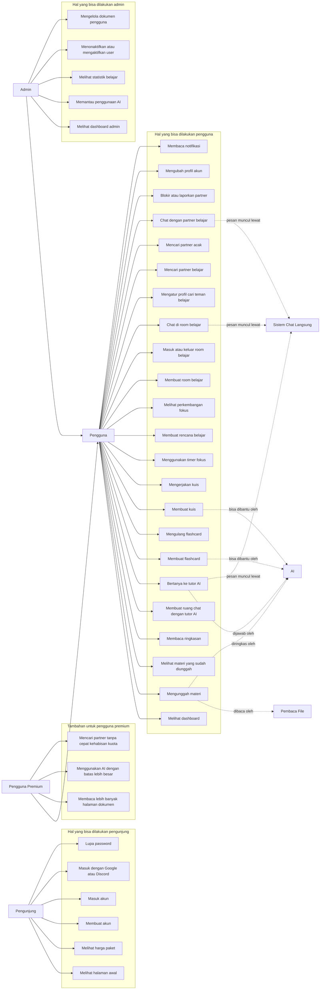
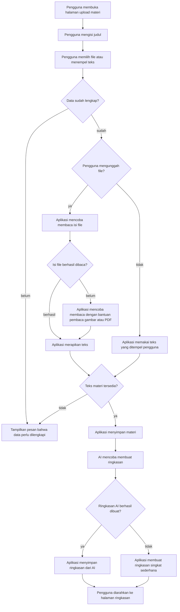
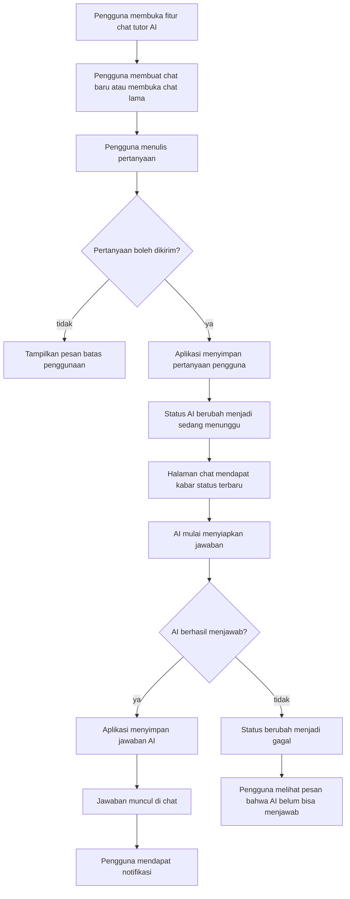
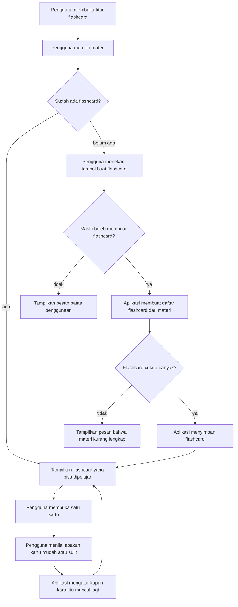
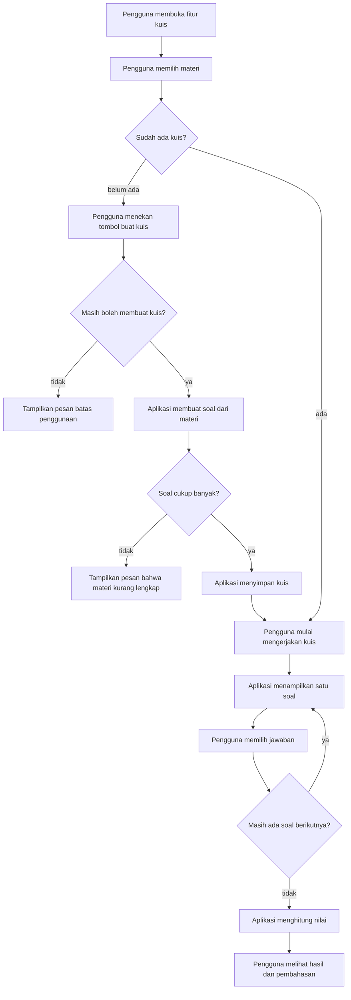
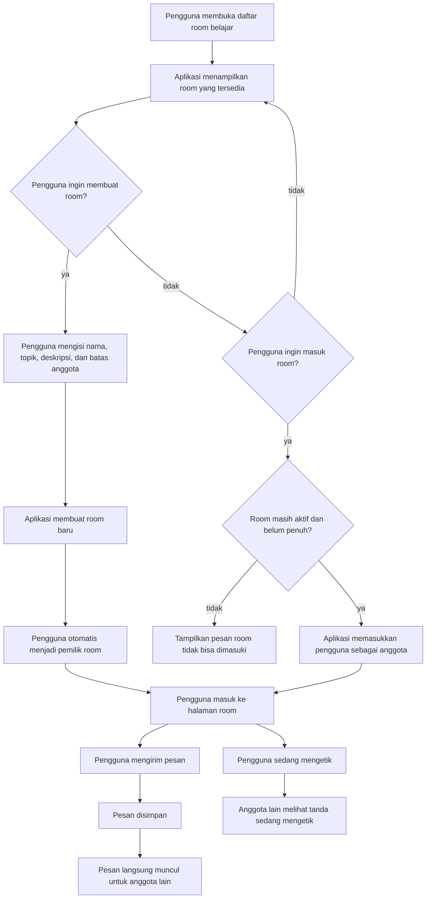
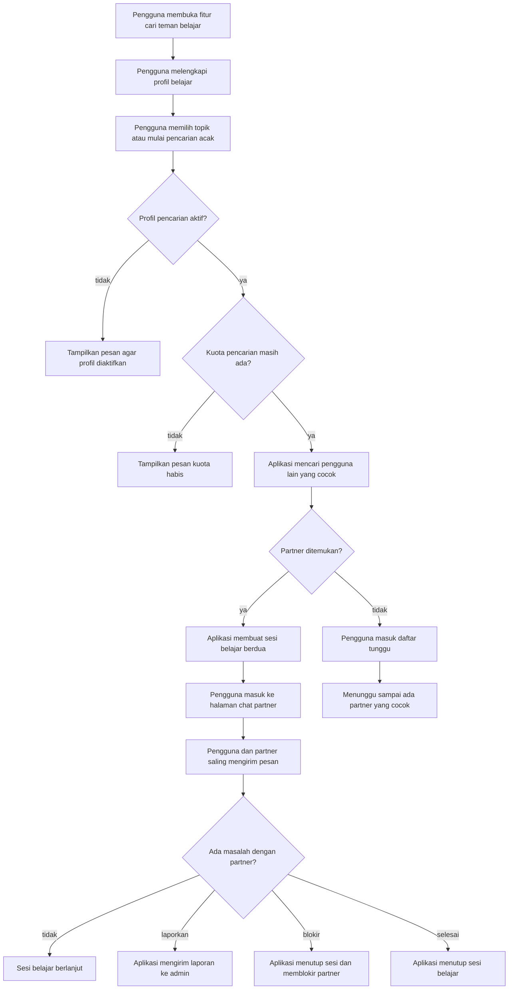
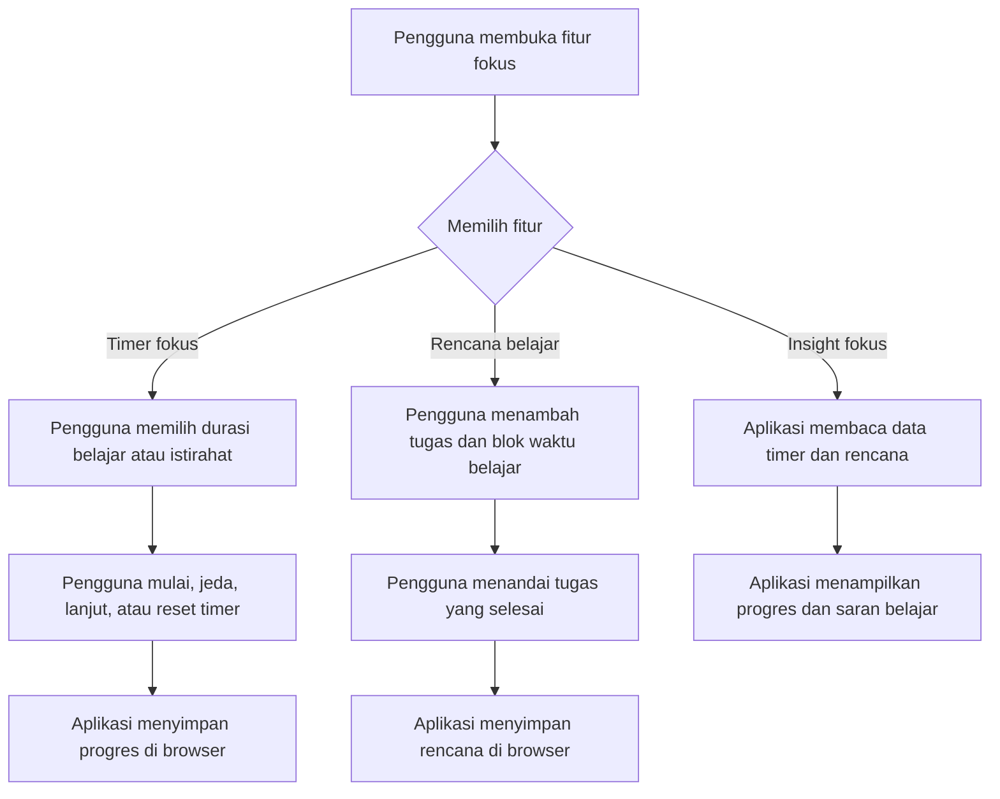
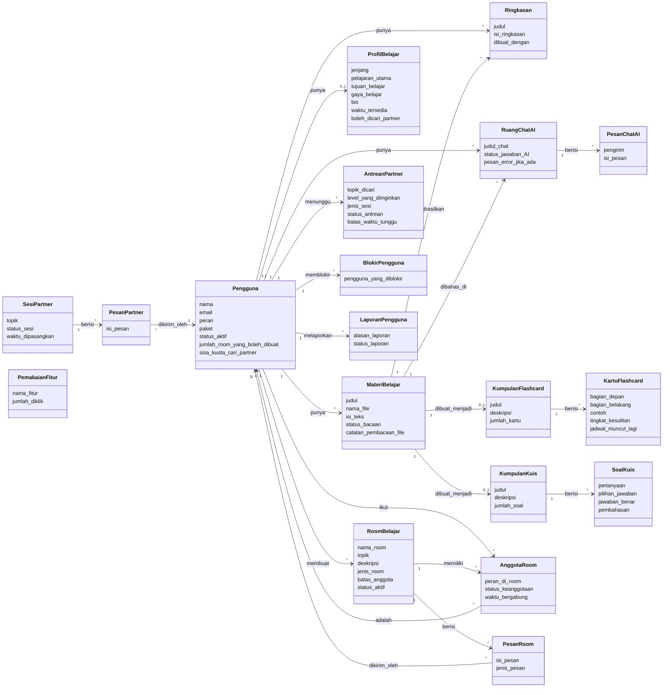
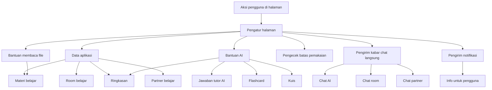

# Diagram Pelajarin.ai dengan Bahasa Sederhana

Dokumen ini menjelaskan alur aplikasi Pelajarin.ai berdasarkan isi repository. Bahasa yang dipakai sengaja dibuat sederhana agar mudah dipahami oleh pengguna, dosen, reviewer, atau tim non-teknis.

## 1. Gambaran Singkat Aplikasi

Pelajarin.ai adalah aplikasi belajar yang membantu pengguna mengubah materi menjadi ringkasan, chat tutor AI, flashcard, kuis, sesi fokus, ruang belajar bersama, dan pencarian teman belajar.

Secara umum, aplikasi ini punya beberapa bagian:

| Bagian | Penjelasan Sederhana |
| --- | --- |
| Halaman umum | Halaman awal, harga paket, daftar akun, dan masuk akun |
| Area pengguna | Tempat pengguna belajar, upload materi, chat AI, kuis, flashcard, dan fokus belajar |
| Ruang belajar | Tempat pengguna membuat atau ikut room belajar bersama |
| Cari teman belajar | Tempat pengguna mencari partner belajar berdasarkan topik |
| Notifikasi | Tempat pengguna melihat kabar terbaru dari chat, room, atau AI |
| Area admin | Tempat admin melihat statistik, memantau AI, mengelola user, dan dokumen |
| Bantuan AI | Bagian yang membantu membuat ringkasan, jawaban chat, flashcard, dan kuis |
| Chat langsung | Bagian yang membuat pesan dan status mengetik muncul secara real-time |

## 2. Struktur Folder Repository

```text
app/                       Isi utama aplikasi
  Http/Controllers/         Pengatur alur saat user membuka atau mengirim data
  Models/                   Bentuk data yang disimpan aplikasi
  Services/                 Bantuan proses seperti baca file, AI, dan cari partner
  Jobs/                     Tugas yang dikerjakan di belakang layar
  Events/                   Pengirim kabar real-time
  Notifications/            Pengirim notifikasi
  Support/                  Bantuan kecil seperti batas pemakaian dan format pesan
database/                  Tabel database, data contoh, dan factory test
resources/views/           Tampilan halaman
resources/js/              Interaksi halaman, timer, planner, dan chat real-time
resources/css/             Tampilan visual aplikasi
routes/                    Daftar alamat halaman dan aksi aplikasi
config/                    Pengaturan aplikasi
tests/                     Pengujian fitur
public/                    File yang langsung dibuka browser
```

## 3. Use Case Diagram

Diagram ini menunjukkan siapa saja yang memakai aplikasi dan hal apa yang bisa mereka lakukan.

### Aktor

| Aktor | Arti |
| --- | --- |
| Pengunjung | Orang yang belum masuk akun |
| Pengguna | Orang yang sudah masuk akun |
| Pengguna Premium | Pengguna yang punya paket lebih tinggi |
| Admin | Pengelola aplikasi |
| AI | Layanan pintar yang membantu membuat isi belajar |
| Pembaca File | Alat yang membantu membaca isi dokumen atau gambar |
| Sistem Chat Langsung | Sistem yang membuat pesan muncul tanpa refresh halaman |



## 4. Activity Diagram

Activity diagram menjelaskan urutan kejadian saat pengguna memakai fitur utama.

### 4.1 Mengunggah Materi dan Mendapat Ringkasan



### 4.2 Bertanya ke Tutor AI



### 4.3 Membuat dan Mengulang Flashcard



### 4.4 Membuat dan Mengerjakan Kuis



### 4.5 Room Belajar Bersama



### 4.6 Mencari Teman Belajar



### 4.7 Timer Fokus dan Rencana Belajar



## 5. Class Diagram Data Aplikasi

Diagram ini menunjukkan data apa saja yang disimpan aplikasi dan hubungannya. Nama di dalam diagram dibuat mudah dibaca, bukan mengikuti nama file program secara mentah.



## 6. Diagram Bagian Dalam Aplikasi

Diagram ini menjelaskan bagian aplikasi yang bekerja di balik layar dengan istilah yang lebih mudah dimengerti.



## 7. Alur Chat Langsung

| Tempat Chat | Siapa yang boleh melihat | Untuk apa |
| --- | --- | --- |
| Chat AI | Pemilik chat tersebut | Melihat pertanyaan dan jawaban tutor AI |
| Room belajar | Anggota room, atau semua user jika room publik | Chat bersama di room |
| Chat partner | Dua pengguna yang sedang dipasangkan | Belajar berdua |
| Notifikasi pribadi | Pemilik akun | Menerima kabar terbaru |

Kabar yang bisa muncul langsung:

| Kabar | Arti |
| --- | --- |
| Pesan tutor AI masuk | AI sudah menjawab pertanyaan |
| Status AI berubah | AI sedang menunggu, memproses, selesai, atau gagal |
| Pesan room masuk | Ada pesan baru di room belajar |
| Ada yang sedang mengetik di room | Anggota room sedang mengetik |
| Pesan partner masuk | Partner belajar mengirim pesan |
| Partner sedang mengetik | Partner sedang menulis pesan |

## 8. Data yang Disimpan Aplikasi

| Data | Isi Sederhana |
| --- | --- |
| Pengguna | Nama, email, peran, paket, status akun, dan batas penggunaan |
| Materi belajar | Judul, file, isi teks, status hasil baca file |
| Ringkasan | Hasil ringkasan dari materi |
| Chat AI | Ruang percakapan antara pengguna dan tutor AI |
| Pesan chat AI | Pertanyaan pengguna dan jawaban AI |
| Flashcard | Kartu belajar dari materi |
| Kuis | Soal pilihan ganda dari materi |
| Profil belajar | Minat, tujuan, gaya belajar, dan ketersediaan pengguna |
| Room belajar | Ruang belajar bersama berdasarkan topik |
| Anggota room | Daftar user yang ikut room |
| Pesan room | Isi chat di room |
| Antrean partner | Daftar user yang sedang mencari teman belajar |
| Sesi partner | Pasangan belajar yang sudah ditemukan |
| Pesan partner | Isi chat antar partner |
| Blokir pengguna | Daftar user yang diblokir |
| Laporan pengguna | Laporan masalah ke admin |
| Notifikasi | Kabar terbaru untuk user |
| Pemakaian fitur | Jumlah klik fitur tertentu |

## 9. Halaman yang Ada di Aplikasi

| Halaman | Fungsi |
| --- | --- |
| Halaman awal | Mengenalkan Pelajarin.ai |
| Harga paket | Menampilkan pilihan paket |
| Login dan register | Masuk dan membuat akun |
| Dashboard | Ringkasan aktivitas belajar pengguna |
| Upload materi | Menambahkan materi baru |
| Daftar materi | Melihat materi yang pernah diunggah |
| Ringkasan | Membaca ringkasan materi |
| Chat AI | Bertanya ke tutor AI |
| Flashcard | Mengulang materi dengan kartu belajar |
| Kuis | Latihan soal dari materi |
| Pomodoro | Timer fokus belajar |
| Rencana belajar | Menyusun tugas dan blok waktu belajar |
| Insight fokus | Melihat progres fokus |
| Room belajar | Belajar bersama banyak user |
| Cari partner | Mencari teman belajar |
| Notifikasi | Melihat kabar terbaru |
| Profil | Mengubah data akun |
| Admin dashboard | Ringkasan untuk admin |
| Monitoring AI | Melihat penggunaan AI |
| Statistik pembelajaran | Melihat statistik aktivitas belajar |
| Kelola user | Mengaktifkan atau menonaktifkan akun |
| Kelola dokumen | Melihat dan menghapus dokumen pengguna |

## 10. Alamat Fitur Utama

| Alamat | Fungsi |
| --- | --- |
| `/` | Halaman awal |
| `/pricing` | Harga paket |
| `/dashboard` | Dashboard pengguna |
| `/materials` dan `/upload` | Materi belajar |
| `/summary` | Ringkasan |
| `/chat` | Chat tutor AI |
| `/quiz` | Kuis |
| `/flashcards` | Flashcard |
| `/pomodoro` | Timer fokus |
| `/focus-planner` | Rencana belajar |
| `/focus-insights` | Insight fokus |
| `/rooms` | Room belajar |
| `/matchmaking` | Cari partner belajar |
| `/profile` | Profil akun |
| `/notifications` | Notifikasi |
| `/admin/*` | Area admin |

## 11. Catatan Penting

1. Jawaban tutor AI tidak selalu langsung muncul, karena aplikasi menyiapkan jawabannya di belakang layar.
2. Jika AI belum tersedia, beberapa fitur tetap mencoba membuat hasil sederhana dari teks materi.
3. File PDF atau gambar bisa dibaca jika alat pembaca file di server sudah tersedia.
4. Timer fokus dan rencana belajar disimpan di browser pengguna, bukan di database.
5. Chat langsung membutuhkan sistem real-time agar pesan bisa muncul tanpa refresh.
6. Admin punya halaman khusus untuk memantau aplikasi dan mengelola data.

